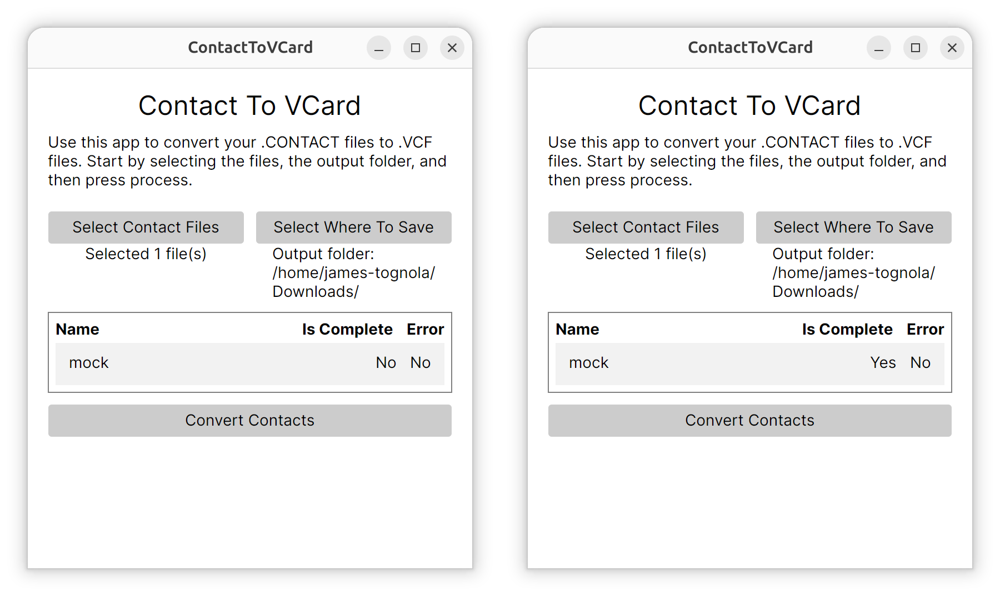
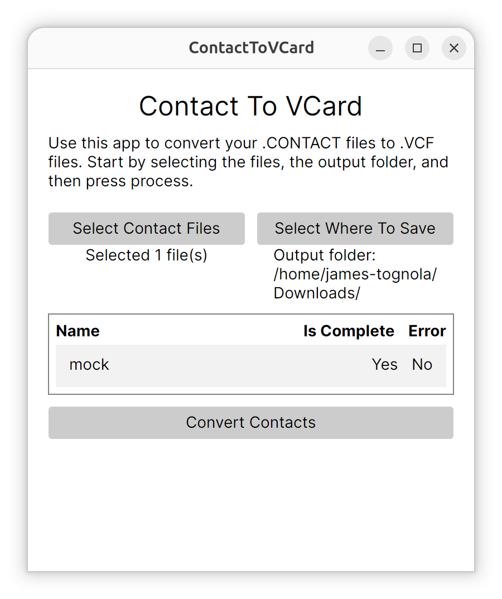

# ContactToVCard



> :checkered_flag: To use, [download](https://github.com/PeterTognola/ContactToVCard/releases) the latest version and open/run it. Further information can be found under [Quick Start](#quick-start).

## What is ContactToVCard

A small, completely offline, multi-platform app to convert Microsoft Contact (`.CONTACT`) files to VCard files (`.VCF`).

**Useful if:**

- You have some old .CONTACT files;
- Still using Windows Contacts/People;
- Have legacy software using .CONTACT files;
- Need to open some old files you've found;
- And more...

**And you need to convert to the VCard standard for using elsewhere or continued support with other apps.**

## Quick Start

To get started, all you need to do is download the executable program files from [here](https://github.com/PeterTognola/ContactToVCard/releases).

Once downloaded, open the file and the app will appear (it may say untrusted source, you will need to click more info/continue).

**Using the app:**

1. Press `Select Contact Files` and select the .CONTACT files you want to convert.
2. Press `Select Where To Save` and select a folder where you want the .VCF files to be saved.
3. Press `Convert Contacts` and they will appear in that folder shortly.
4. Any issues and status are shown in the table (see screenshot for an example of successful conversion).



## Building

Built using C# .NET 10, all you need is the sdk installed (can be checked via `dotnet --version`) or downloaded from [here](https://dotnet.microsoft.com/en-us/download).

Once installed, clone the repo and then build/run inside the root folder via `dotnet build && dotnet run`.

## What's Supported

This project is in active development, so not everything in .CONTACT files is supported yet. Below is a list of what is and isn't supported.

| Contact Data  | VCard Support       | CSV Support |
|---------------|---------------------|-------------|
| First Name    | :white_check_mark:  | :x:         |
| Last Name     | :white_check_mark:  | :x:         |
| Other Names   | :x:                 | :x:         |
| Email Address | :white_check_mark:  | :x:         |
| Addresses     | :white_check_mark:  | :x:         |
| Date of Birth | :x:                 | :x:         |
| Anniversary   | :x:                 | :x:         |
| Phone Numbers | :white_check_mark:  | :x:         |
| Company       | :x:                 | :x:         |
| Job Title     | :x:                 | :x:         |
| Website       | :white_check_mark:  | :x:         |
| Custom Fields | See Roadmap         | :x:         |

> If otherwise stated, elements like "Other Address" that are their own entity will be merged with the corresponding VCard element via a type.

## Rationale

The reason for this project is I came across some old .CONTACT files while going through some old hard drives. I wanted to move them to my phone, but unfortunately, this file type is not supported by modern phones or apps (Android or iPhone).

The only solutions online I could find either were via a website (which I wouldn't trust, due to the sensitivity of the data), using Outlook and Exccel, or via Powershell scripts/Excel.

So I thought I'd put together a simple-to-use app to do this (and hadn't had the opportunity to work with XAML/MVVM for a few years).

## Roadmap

The app is functional and provides basic functionality. The support of data types can be found under [What's Supported](#whats-supported) section. There are plans to improve further:

| Feature                    | Status      | Completion Estimate |
|----------------------------|-------------|---------------------|
| Complete Entity Coverage   | In Progress | July 2026           |
| Status Report/Health Check | Not Started | July 2026           |
| CSV Export                 | In Progress | August 2026         |
| Signed/Trusted EXE         | Not Started | August 2026         |
| Custom Fields/Attributes   | Not Started | September 2026      |
| Mac Releases (?)           | Not Started | September 2026      |

> The completion estimate are loosley based estimates based on my available time. If you want to contribute, anything that hasn't been started can be picked up. For more details, see below for contributing guide.

## Contributing

Any contributions are appreciated and welcome, from bug reports to implementing features. There are a few ways to go about this, detailed below.

### Bugs

Think you've found a bug? Report it in the issues tab in Github.  Here are some pre-requisites before reporting it though:

1. Check that you've got the latest version.
2. Double check that an existing issue doesn't already exist.
3. If you've done the above and it is still valid, raise an **Issue** (tagged with `Bug`) with as much detail as possible (what you were doing, what platform, and any screenshots/expected functionality).

Want to fix it, just raise a pull request and it will get merged and tested with the latest version.

### Suggesting Features

Have a cool idea? Perfect, just raise it with an **Issue**, tagged with `enhancement` and include clear concepts of the feature.

Want to develop this feature to be included with the project? Please just raise a PR attached to the **Issue** and it will be merged and tested with the latest version.

### Code Contributions

Due to the size of the project, the structure and methodology are very basic but there are a few key areas to consider when contributing that may affect the speed at which the bug/feature are merged.

This project is built with Avalonia UI and follows a simple MVVM layout.

### App Entry Point

- `App.axaml` defines the application theme and registers the view locator.
- `App.axaml.cs` creates the desktop window, file picker service, and contact conversion service.
- `ViewLocator.cs` maps view models to their matching views.

### Main Window Layout

- Title and introduction text at the top of the window.
- File selection summary with a button to choose `.CONTACT` files.
- Output folder summary with a button to choose the destination folder.
- Status table showing each selected file, completion state, and errors.
- Convert button to run the contact-to-vCard process.

### Data Flow

- `MainWindowViewModel` holds the window state and command handlers.
- `IFilePickerService` handles file and folder selection.
- `IConvertContactService` converts each contact file into a `.VCF` file.

### Structure

```text
ContactToVCard/
├── Assets/
│   ├── Screenshots, icons, and sample `.CONTACT` files used for documentation and design-time preview.
│   └── Example files for testing conversion flow.
├── Converters/
│   └── UI value converters used by Avalonia bindings.
├── Controls/
│   └── Reusable custom controls used by views.
├── Helpers/
│   └── Shared helper methods and utility functions.
├── Models/
│   └── Data models and file representations used by the conversion logic.
├── Services/
│   └── Application services such as file picking and contact conversion.
├── ViewModels/
│   └── MVVM view models that expose state and commands to the UI.
├── Views/
│   └── Avalonia windows and views that define the app UI.
├── App.axaml
│   └── Application-level XAML, theme setup, and data template registration.
├── App.axaml.cs
│   └── Application startup, dependency wiring, and main window creation.
├── Program.cs
│   └── Entry point for the Avalonia application.
├── ViewLocator.cs
│   └── Resolves view models to their corresponding views.
├── ContactToVCard.csproj
│   └── Project configuration, package references, and build settings.
├── ContactToVCard.sln
│   └── Solution file for opening the project in an IDE.
├── app.manifest
│   └── Application manifest and platform-specific metadata.
└── readme.md
    └── Project overview, usage notes, supported features, and contribution guidance.
```

### Branching Strategy

The strategy is a basic `master < develop < hotfix|feature/branch-name`.

For any PRs, please create branches from `develop` using the `hotfix/feature` methodology.

- `master` proected branch where releases are created from.
- `develop` another protected branch where the latest version of all features and bugs, waiting to be released, are held.
